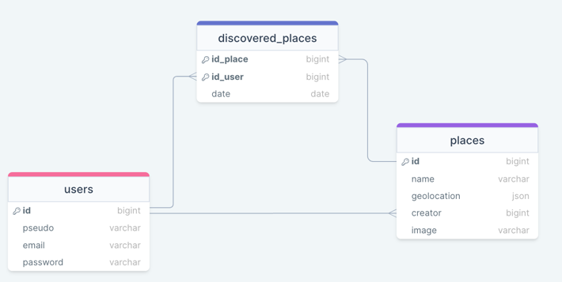

# GeoSpot API

## Features

- [x] User authentication
- [x] Handle spot (CRUD, image, geolocation)
- [x] Handle discovered spot

## Getting Started

### Prerequisites

- PHP 8
- Composer
- Docker & Docker Compose

### Installing

- Clone this repository
- Run `docker-compose up` to start the server
- Into the container, run `php artisan migrate` to create the database
- Into the container, run `php artisan storage:link` to create the storage link

## Notes

- The API is available at `http://localhost/api`
- The API storage is available at `http://localhost/storage`
- For usage examples, load the insomnia file (resources/insomnia) into Insomnia

## Database Model

